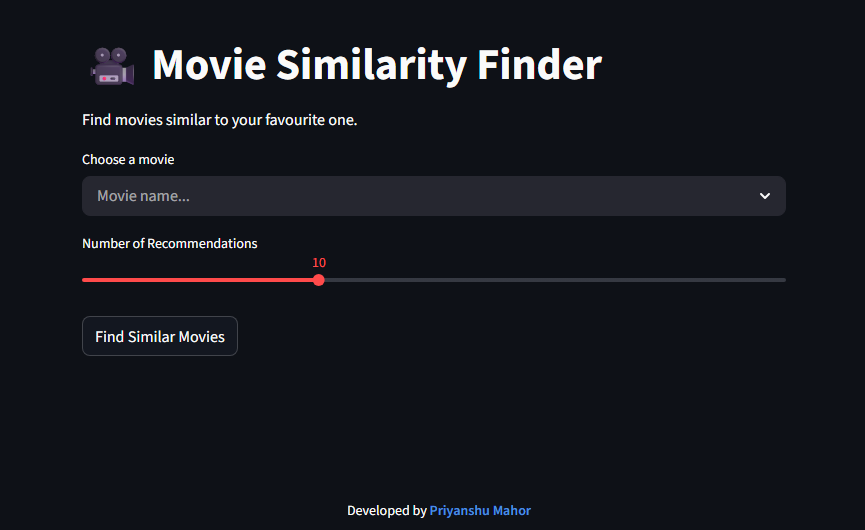
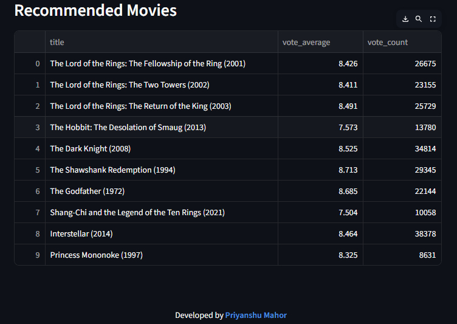

# Movie-Similarity-Finder using NLP

**Link👉** https://movie-similarity-finder-wr8hbbxsghtkfjzcsibkfz.streamlit.app/

After enjoying a great movie, finding another film with a similar storyline is often difficult. This project solves that problem by building a Movie Similarity Finder that recommends movies based on plot similarity using Natural Language Processing techniques.

The system allows users to select a movie and instantly receive a list of similar movies with comparable themes and narratives, helping users discover relevant content efficiently.

-----
## Dataset
- **Source** - TMDB-derived dataset (pre-2025)
- **Size** - ~10,000 Movies
  
**Features** -
*   Title
*   Overview (plot summary)
*   Vote Average
*   Vote Count
*   Popularity
*   Release Date

-----
## Approach
This project implements a hybrid content-based recommendation system that combines plot similarity with rating-based control.

**Data Preprocessing**-
* Movies with missing plot removed.
* A unified text feature is created by extracting title and overview.

**Text Vectorization**-
* TF-IDF(Turn Frequency-Inverse Document Frequency) is applied to convert plot text into numerical vectors.
* Stop words are removed, and the feature space is limited to the most relevant terms.

**Similarity Computation**-
* Cosine Similarity is used to compute the similarity between movies based on TF-IDF vectors.

**Quality based Re-Ranking**-
* A weighted rating score is calculated using vote average and vote count.
* Popularity is logarithmically scaled to prevent dominance by highly popular movies.
* Scores are normalized using Min-Max scaling.

**Hybrid Scoring**-
Final recommendation scores are computed using a weighted combination of:
* Plot Similarity
* Normalized weighted rating
* Normalized popularity

This ensures the recommendations are both relevant and high-quality.

**Similarity Computation**- A Streamlit based web UI.

## 📸 Demo

### Home Screen

### Movie Search

### Recommendations Output

## Tech Stack
* **Language**- Python
* **Libraries**- Pandas, Numpy, scikit-learn, streamlit
* **Techniques**- NLP (TF-IDF), Cosine Similarity, Feature Scaling

## Limitation
* This is a content-based system and does not user-interaction data.
* Recommendations quality depends on the accuracy of plot summaries.
* Collaborative Filtering is not implemented.
